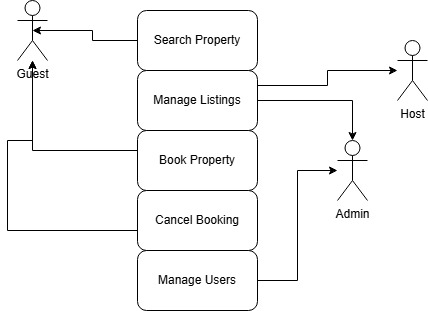

# Requirement Analysis in Software Development

## Introduction

This repository explores the concept of Requirement Analysis within the Software Development Lifecycle (SDLC). It covers its definition, importance, key activities, types of requirements, and tools like use case diagrams and acceptance criteria that help guide successful software projects.

---

## What is Requirement Analysis?

Requirement Analysis is the process of determining user expectations for a new or modified product. It involves collecting, understanding, and documenting the needs and constraints of stakeholders. It is a critical phase in the SDLC, helping to bridge the gap between business needs and technical implementation.

---

## Why is Requirement Analysis Important?

- **Prevents Scope Creep**: Clearly defined requirements help avoid unplanned features or changes during development.
- **Ensures Alignment**: Ensures all stakeholders have a shared understanding of what will be built.
- **Reduces Development Costs**: Identifying errors or gaps early minimizes rework, saving time and money.

---

## Key Activities in Requirement Analysis

- **Requirement Gathering**: Collecting initial requirements from stakeholders.
- **Requirement Elicitation**: Refining and exploring requirements using techniques like interviews, surveys, and workshops.
- **Requirement Documentation**: Formalizing requirements in documents such as SRS and use cases.
- **Requirement Analysis and Modeling**: Analyzing and organizing requirements, sometimes using diagrams and models.
- **Requirement Validation**: Reviewing requirements with stakeholders to ensure completeness and correctness.

---

## Types of Requirements

### Functional Requirements

These describe what the system should do.

- **Examples (Booking System)**:
  - User can register and log in.
  - Property listings can be searched and filtered.
  - Bookings can be made and canceled.

### Non-functional Requirements

These describe how the system performs or behaves.

- **Examples (Booking System)**:
  - The system must handle up to 1000 concurrent users.
  - Page load time should not exceed 2 seconds.
  - Passwords must be encrypted.

---

## Use Case Diagrams

Use Case Diagrams visualize interactions between users (actors) and the system, helping identify functional requirements.

### Benefits

- Provide a clear overview of system functionality.
- Help communicate with both technical and non-technical stakeholders.
- Aid in planning development and testing activities.

---

## Acceptance Criteria

Acceptance Criteria define the conditions that a software feature must meet to be accepted by stakeholders. They ensure features are working as intended and aligned with user expectations.

### Example: Checkout Feature

- User must be logged in.
- System must confirm booking details before checkout.
- Payment must be processed through an integrated gateway.
- User receives a confirmation email after successful booking.
